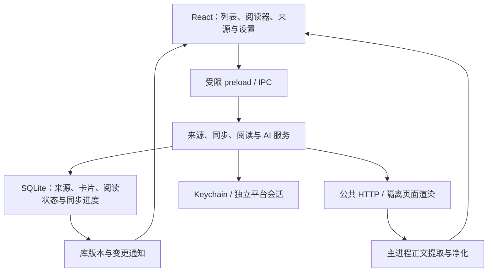

# Reading Hub 当前架构

更新于 2026-09-09。本文说明当前代码的职责与数据流；逐轮问题、复现和验证保留在[审查记录](architecture-review.md)，界面约束见[界面规范](ui-design.md)。

## 分层与边界

保留单机 Electron、SQLite 与 React 的组合：服务在主进程中组装，渲染器通过明确的 IPC 契约操作，不直接访问数据库、凭据或任意文件。当前没有需要独立部署的后端，拆成远程服务会改变本地优先的数据与权限边界。

| 职责 | 当前入口 | 维护时应保持的契约 |
| --- | --- | --- |
| 依赖组装与关闭 | [app-services.ts](../src/main/app-services.ts) | 构造服务与启动工作分开；关闭时先停止接收任务，再等待活动工作，最后关闭数据库。 |
| IPC | [ipc-handlers.ts](../src/main/ipc-handlers.ts)、[ipc-validation.ts](../src/main/ipc-validation.ts) | 校验不可信参数；流和取消请求归属于发起窗口；不暴露通用执行能力。 |
| 来源预览与确认 | [source-service.ts](../src/main/source-service.ts) | 预览保存有期限、有限容量的不可变快照；确认通过明确 token 消费；取消订阅保留阅读资产。 |
| 调度与连接器 | [sync-manager.ts](../src/main/sync-manager.ts)、[connector-registry.ts](../src/main/connector-registry.ts) | 同一来源协调执行；取消、重试、退避与关机有明确归属；平台差异位于连接器。 |
| 持久化 | [database.ts](../src/main/database.ts) | 文章身份、来源关系与用户状态分别建模；写入与通知配合，迁移和维护必须可恢复。 |
| 网络与凭据 | [http.ts](../src/main/http.ts)、[robots.ts](../src/main/robots.ts)、[secrets.ts](../src/main/secrets.ts) | 公共地址校验、robots 和同域限速；保留明确的本机 Feed 例外；密钥不进入卡片库和日志。 |
| 正文管线 | [article-reader.ts](../src/main/article-reader.ts) | 先恢复语义载体，再提取、净化和渲染；不把原站脚本、事件处理器或样式送入阅读器。 |
| AI | [ai-service.ts](../src/main/ai-service.ts) | 显式发起、受限上下文、可取消流；对话不写入卡片数据库。 |

## 渲染器中的状态归属

| 状态 | 所有者 | 异步完成规则 |
| --- | --- | --- |
| 来源、列表、分页、筛选和读取错误 | [use-library-data.ts](../src/renderer/use-library-data.ts) | 导航是一份完整查询；刷新使用执行时的当前查询，旧请求不能覆盖新结果。 |
| 已读与收藏写入 | [use-entry-mutations.ts](../src/renderer/use-entry-mutations.ts) | 按文章与字段合并重复意图、顺序执行相反意图；已确认写入先更新本地快照，再读取校准结果。 |
| 当前阅读文章、对话框会话 | [App.tsx](../src/renderer/App.tsx) | 阅读器跟随同 id 的已返回元数据；筛选后找不到文章时保留阅读快照；旧弹窗完成不能关闭新会话。 |
| 跨功能活动提示 | [use-async-activity.ts](../src/renderer/use-async-activity.ts) | 统计重叠活动，不把“忙碌”误当全局执行锁。 |
| 视图内互斥操作 | [use-async-action.ts](../src/renderer/use-async-action.ts) | 同步阻止重复提交；仅当前请求可以更新当前视图错误和状态。 |
| 通知与撤销 | [use-library-notice.ts](../src/renderer/use-library-notice.ts) | 撤销对象与消息共享独立身份；失败保留重试，旧完成不能覆盖新通知。 |
| 原生窗口全屏状态 | [use-window-fullscreen.ts](../src/renderer/use-window-fullscreen.ts) | 实时事件优先于迟到的启动快照；订阅与读取归属同一次 effect，卸载和重放使旧结果失效。 |
| 阅读密度、字号和保存结果 | [reader-preferences-context.tsx](../src/renderer/reader-preferences-context.tsx) | 应用级 Provider 保留当前会话状态；阅读器与设置页共享控制器，用户更改与重试才写存储，失败不撤回已生效偏好。 |
| AI 服务列表与读取状态 | [use-ai-providers.ts](../src/renderer/use-ai-providers.ts) | 每个视图拥有独立的公共元数据快照；首次发现和重试共享互斥与过期响应保护，选择服务不触发读取，空列表为可恢复错误。 |
| AI 配置写入与草稿 | [settings-view.tsx](../src/renderer/settings-view.tsx) | 通过共享发现器读取配置，写入仍独立管理；读取成功前不允许编辑，读取失败不能撤销或重复已完成写入。 |
| 正文与 AI 展示 | [reader-view.tsx](../src/renderer/reader-view.tsx) | 正文请求按文章身份失效；元数据刷新不重载正文；成功显示才自动标记已读。 |

写入成功和后续读取成功是两个结果：刷新失败不能否认已经完成的写入。卡片保留已确认字段，错误通过读模型提示；全局计数和完整筛选结果在读取成功后校准；计数有独立有效性状态，首次未载入或读取失败时不把旧数字显示为当前结果，关闭提示或开始重试不会清除此状态。阅读器的离开列表快照不代表额外的后台订阅，不根据“未返回”猜测删除或字段变化。

删除和恢复同样分开处理写入与后续读取：删除提交后保留撤销通知，读取错误不能覆盖其身份和恢复对象；真正的删除失败不关闭阅读器，也不生成撤销。列表与卡片显式要求删除、恢复两个回调，最近删除视图不允许把缺失的恢复操作回退为删除。

下一页失败也归列表读模型所有：保留已加载卡片、游标和统计有效性，在分页区域提供重试。成功加载或成功完整刷新清除分页错误，导航重置查询时同步清除；旧请求的失败不能污染新查询。分页错误不通过 App 的全局通知传播，不替换删除撤销等操作结果。

AI 回答各自保存发起请求时的服务 id 和显示名称；请求路由与消息署名使用同一快照。当前服务选择只决定后续问题，不能重新归属既有的完整、生成中或失败回答。对话继续只存在当前阅读会话内，不写入数据库。

AI 设置、阅读面板和划词卡片复用 AiProviderFeedback 的加载、错误及重读入口。面板在发现服务前允许编辑草稿，但不发送问题；重试只恢复列表。划词重试成功后仅发起先前明确请求的那次操作，关闭卡片后迟到的读取不能再启动 AI；翻译始终只发送选中文本。

## 正文和视觉的共同契约

- 公式只处理作者明确提供的分隔符与语义载体，代码、转义和普通货币文本保持原义。公式在自有容器横向滚动，编号不覆盖主体。
- 响应式图片的候选语法由 [srcset.ts](../src/shared/srcset.ts) 解析，地址权限与候选选择仍归主进程。阅读器延续选择较大安全图片的策略，不模拟原站视口、sizes 和媒体查询。
- 图片候选地址统一校验。懒加载回退逐图处理，不能仅因相邻就删除不同图片；HTML 进入渲染器前净化。
- 界面、正文、代码各用一套共享字体变量；操作按钮复用尺寸、字重、圆角及语义颜色。列表、阅读器和 AI 内容分别有受约束的滚动区域。

## 验证入口与证据范围

[AGENTS.md](../AGENTS.md) 是完成门禁。单元与集成测试验证契约和故障路径；`audit:renderer` 运行真实 React、preload 和内存数据库；`audit:visual` 检查四档原生布局、125% 字号及正文边界；`audit:reader` 通过只读数据库快照检查每个来源的最新与一个历史样本。

确定性测试不证明远端平台实时可用，抽样审计不等于全部历史文章通过。网络、robots、登录和原图可达性必须以当次报告为准。审计报告和截图放在临时目录，不提交正文、用户数据库、凭据或构建产物。
